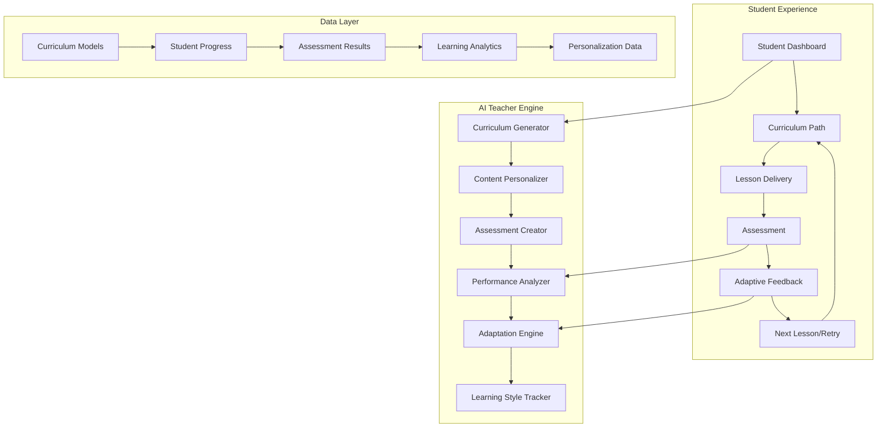
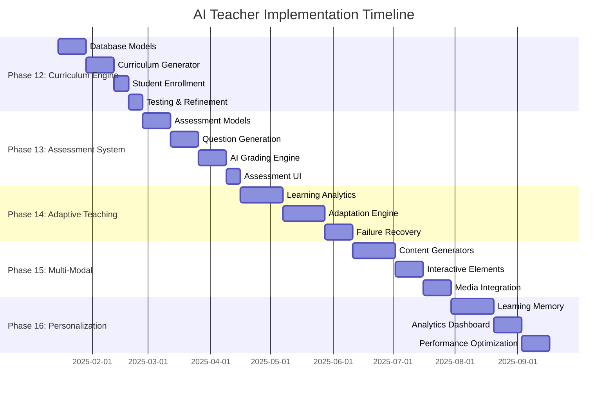

# AI Teacher — Comprehensive Transformation Plan

**Vision**: Transform the existing Q&A RAG system into an intelligent, adaptive AI teacher that creates personalized learning experiences, dynamically adjusts teaching methods, and ensures student mastery through continuous assessment and adaptation.

---

## 🎯 Executive Summary

This plan transforms your current RAG-based Q&A system into a revolutionary AI teacher that:

- **Personalizes Learning**: Adapts to each student's unique learning style and pace
- **Ensures Mastery**: Uses continuous assessment to guarantee understanding
- **Adapts Dynamically**: Automatically generates new explanations when students struggle
- **Tracks Progress**: Maintains detailed learning analytics and improvement metrics
- **Scales Globally**: Supports multiple subjects, languages, and learning modalities

---

## 📊 Current System Analysis

### ✅ **Existing Strengths**
- **Solid Foundation**: NextAuth, RBAC, multi-tenant organizations
- **RAG Infrastructure**: pgvector, OpenAI embeddings, document ingestion
- **Modern Tech Stack**: Next.js, Prisma, PostgreSQL, Redis, BullMQ
- **Production Ready**: Security audit, i18n support, deployment pipeline
- **User Management**: Students, teachers, guardians, admins with communication system

### 🔄 **Transformation Needed**
- **From Q&A to Structured Learning**: Replace open-ended questions with curriculum-driven lessons
- **From Static to Adaptive**: Add dynamic content generation based on performance
- **From Passive to Active**: Implement assessments, quizzes, and mastery verification
- **From Generic to Personalized**: Track individual learning patterns and preferences

---

## 🏗️ Architecture Overview



---

## 📅 Implementation Phases

### **Phase 12 — Curriculum Engine** 🎓
*Duration: 3-4 weeks*

**Goal**: Transform from document-based Q&A to structured curriculum delivery

#### Database Models
```prisma
model Subject {
  id          String   @id @default(cuid())
  name        String   // "Mathematics", "Physics", "History"
  description String?
  level       SubjectLevel // elementary, middle, high, college
  isActive    Boolean  @default(true)
  createdAt   DateTime @default(now())
  
  topics      Topic[]
  enrollments StudentEnrollment[]
}

model Topic {
  id          String   @id @default(cuid())
  subjectId   String
  name        String   // "Algebra", "Geometry", "Calculus"
  description String?
  order       Int      // Sequence within subject
  
  subject     Subject  @relation(fields: [subjectId], references: [id])
  lessons     Lesson[]
}

model Lesson {
  id            String   @id @default(cuid())
  topicId       String
  title         String
  content       String   @db.Text
  objectives    String[] // Learning objectives
  difficulty    DifficultyLevel
  estimatedTime Int      // Minutes
  order         Int      // Sequence within topic
  
  topic         Topic    @relation(fields: [topicId], references: [id])
  prerequisites LessonPrerequisite[]
  assessments   Assessment[]
  progress      StudentProgress[]
}

model StudentEnrollment {
  id          String   @id @default(cuid())
  studentId   String
  subjectId   String
  startedAt   DateTime @default(now())
  completedAt DateTime?
  
  student     User     @relation(fields: [studentId], references: [id])
  subject     Subject  @relation(fields: [subjectId], references: [id])
  progress    StudentProgress[]
}
```

#### Key Features
- **Curriculum Generator**: AI creates structured course outlines
- **Adaptive Pathways**: Lessons adapt based on student performance
- **Prerequisites System**: Ensures proper learning sequence
- **Difficulty Scaling**: Automatic adjustment based on student ability

#### API Endpoints
- `POST /api/curriculum/generate` - AI-generated curriculum creation
- `GET /api/curriculum/student/{id}` - Personalized learning path
- `POST /api/curriculum/enroll` - Student subject enrollment
- `GET /api/lessons/{id}/next` - Adaptive next lesson selection

**Exit Criteria**: Students receive personalized curricula instead of open Q&A

---

### **Phase 13 — Assessment & Evaluation System** 📝
*Duration: 4-5 weeks*

**Goal**: Implement comprehensive assessment system for mastery verification

#### Database Models
```prisma
model Assessment {
  id          String   @id @default(cuid())
  lessonId    String
  type        AssessmentType // quiz, test, assignment, project
  title       String
  instructions String  @db.Text
  timeLimit   Int?     // Minutes
  passingScore Float   @default(0.7)
  maxAttempts Int      @default(3)
  
  lesson      Lesson   @relation(fields: [lessonId], references: [id])
  questions   Question[]
  attempts    AssessmentAttempt[]
}

model Question {
  id            String      @id @default(cuid())
  assessmentId  String
  type          QuestionType // multiple_choice, short_answer, essay, coding
  content       String      @db.Text
  points        Float       @default(1.0)
  correctAnswer String?     @db.Text
  explanation   String?     @db.Text
  order         Int
  
  assessment    Assessment  @relation(fields: [assessmentId], references: [id])
  options       QuestionOption[]
  responses     StudentResponse[]
}

model AssessmentAttempt {
  id           String    @id @default(cuid())
  studentId    String
  assessmentId String
  startedAt    DateTime  @default(now())
  completedAt  DateTime?
  score        Float?
  feedback     String?   @db.Text
  passed       Boolean   @default(false)
  
  student      User      @relation(fields: [studentId], references: [id])
  assessment   Assessment @relation(fields: [assessmentId], references: [id])
  responses    StudentResponse[]
}
```

#### Assessment Engine Features
- **Auto-Generated Questions**: AI creates questions from lesson content
- **Multiple Question Types**: MCQ, short answer, essays, coding challenges
- **Adaptive Difficulty**: Questions adjust based on student performance
- **Intelligent Grading**: AI-powered auto-grading with detailed feedback
- **Mastery Tracking**: Progress only after demonstrating understanding

#### AI Grading System
```typescript
interface GradingCriteria {
  conceptUnderstanding: number;
  accuracyOfAnswer: number;
  clarityOfExplanation: number;
  useOfExamples: number;
}

class IntelligentGrader {
  async gradeResponse(
    question: Question,
    studentResponse: string,
    rubric: GradingCriteria
  ): Promise<GradingResult> {
    // AI-powered grading logic
  }
}
```

**Exit Criteria**: Students must pass assessments to progress; automatic remediation for failures

---

### **Phase 14 — Adaptive Teaching Engine** 🧠
*Duration: 5-6 weeks*

**Goal**: Implement intelligent adaptation system that changes teaching approach based on student performance

#### Core Adaptation Logic
```typescript
interface LearningStyle {
  visual: number;      // 0-1 preference for visual content
  auditory: number;    // 0-1 preference for audio explanations
  kinesthetic: number; // 0-1 preference for hands-on learning
  analytical: number;  // 0-1 preference for step-by-step logic
  intuitive: number;   // 0-1 preference for big-picture concepts
}

interface TeachingStrategy {
  explanationStyle: 'detailed' | 'concise' | 'example-heavy' | 'conceptual';
  presentationMode: 'text' | 'visual' | 'interactive' | 'multimedia';
  pacingStyle: 'slow' | 'moderate' | 'fast';
  reinforcementLevel: 'minimal' | 'moderate' | 'extensive';
}

class AdaptiveTeachingEngine {
  async generateAlternativeExplanation(
    lessonContent: string,
    studentProfile: StudentProfile,
    failureReason: string
  ): Promise<AlternativeContent> {
    // AI generates new explanation based on learning style and failure analysis
  }
  
  async adjustDifficulty(
    currentLesson: Lesson,
    performanceHistory: AssessmentResult[]
  ): Promise<Lesson> {
    // Dynamically adjust lesson difficulty
  }
  
  async recommendLearningPath(
    student: Student,
    currentProgress: StudentProgress[]
  ): Promise<LearningPath> {
    // Suggest optimal next steps
  }
}
```

#### Database Models
```prisma
model StudentProfile {
  id              String      @id @default(cuid())
  studentId       String      @unique
  learningStyle   Json        // LearningStyle object
  preferredPace   PaceLevel
  strengthAreas   String[]    // Topics student excels in
  weaknessAreas   String[]    // Topics needing improvement
  motivationLevel Float       @default(0.5)
  
  student         User        @relation(fields: [studentId], references: [id])
  adaptations     LessonAdaptation[]
}

model LessonAdaptation {
  id                String        @id @default(cuid())
  studentId         String
  lessonId          String
  originalContent   String        @db.Text
  adaptedContent    String        @db.Text
  adaptationReason  String
  effectiveness     Float?        // Measured after assessment
  createdAt         DateTime      @default(now())
  
  student           User          @relation(fields: [studentId], references: [id])
  lesson            Lesson        @relation(fields: [lessonId], references: [id])
}

model FailureAnalysis {
  id              String    @id @default(cuid())
  studentId       String
  assessmentId    String
  failureType     FailureType // concept_gap, prerequisite_missing, learning_style_mismatch
  diagnosis       String    @db.Text
  remediation     String    @db.Text
  resolved        Boolean   @default(false)
  
  student         User      @relation(fields: [studentId], references: [id])
  assessment      Assessment @relation(fields: [assessmentId], references: [id])
}
```

#### Adaptive Features
- **Failure Recovery**: Automatic re-teaching with different approaches
- **Learning Style Detection**: ML-based identification of optimal learning modalities
- **Content Regeneration**: AI creates new explanations when students struggle
- **Difficulty Adjustment**: Real-time lesson difficulty modification
- **Progress Optimization**: Intelligent pacing based on individual needs

**Exit Criteria**: Students receive personalized teaching approaches that adapt to their learning patterns

---

### **Phase 15 — Multi-Modal Teaching Interface** 🎨
*Duration: 4-5 weeks*

**Goal**: Enhance learning with visual, auditory, and interactive content

#### Technology Integration
- **Mathematical Rendering**: KaTeX/MathJax for equations
- **Visual Diagrams**: Mermaid, D3.js for dynamic visualizations
- **Interactive Simulations**: Physics simulations, math graphing
- **Text-to-Speech**: Accessible audio explanations
- **Code Execution**: In-browser coding environments

#### Content Generation Engine
```typescript
interface MultiModalContent {
  text: string;
  visuals: VisualContent[];
  audio?: AudioContent;
  interactive?: InteractiveElement[];
}

class ContentGenerator {
  async generateMathVisualization(equation: string): Promise<VisualContent> {
    // Generate graphs, charts, geometric representations
  }
  
  async createInteractiveDemo(concept: string): Promise<InteractiveElement> {
    // Build hands-on learning components
  }
  
  async generateNarration(text: string, style: NarrationStyle): Promise<AudioContent> {
    // Text-to-speech with educational tone
  }
}
```

#### Database Models
```prisma
model MediaContent {
  id          String      @id @default(cuid())
  lessonId    String
  type        MediaType   // image, video, audio, interactive
  url         String
  metadata    Json        // Size, duration, format, etc.
  
  lesson      Lesson      @relation(fields: [lessonId], references: [id])
}

model InteractiveElement {
  id          String      @id @default(cuid())
  lessonId    String
  type        InteractiveType // simulation, quiz, code_editor, diagram
  config      Json        // Element-specific configuration
  
  lesson      Lesson      @relation(fields: [lessonId], references: [id])
}
```

**Exit Criteria**: At least Mathematics subject supports text, equations, visualizations, and interactive elements

---

### **Phase 16 — Personalization & Memory Engine** 🧩
*Duration: 4-5 weeks*

**Goal**: Create long-term learning memory that continuously improves the AI teacher for each student

#### Learning Analytics Engine
```typescript
interface LearningPattern {
  conceptualStrengths: string[];
  proceduralStrengths: string[];
  commonMistakes: string[];
  effectiveStrategies: TeachingStrategy[];
  optimalStudyTimes: string[];
  preferredContentTypes: ContentType[];
}

class PersonalizationEngine {
  async analyzeLearningPattern(
    studentId: string,
    timeframe: TimeRange
  ): Promise<LearningPattern> {
    // ML analysis of student behavior and performance
  }
  
  async predictOptimalContent(
    student: Student,
    upcomingLesson: Lesson
  ): Promise<PersonalizedContent> {
    // Predict best content type for specific student
  }
  
  async recommendInterventions(
    student: Student,
    strugglingConcepts: string[]
  ): Promise<Intervention[]> {
    // Suggest specific remediation strategies
  }
}
```

#### Database Models
```prisma
model LearningAnalytics {
  id                String    @id @default(cuid())
  studentId         String
  dateRange         DateOnly
  conceptsMastered  Int       @default(0)
  timeSpent         Int       // Minutes
  assessmentScores  Float[]
  strugglingTopics  String[]
  improvingTopics   String[]
  
  student           User      @relation(fields: [studentId], references: [id])
}

model PersonalizationData {
  id                    String    @id @default(cuid())
  studentId             String
  effectiveStrategies   Json      // TeachingStrategy[]
  ineffectiveStrategies Json      // TeachingStrategy[]
  optimalDifficulty     Json      // Per-topic difficulty preferences
  contentPreferences    Json      // Preferred content types
  studyPatterns         Json      // Optimal times, duration, etc.
  
  student               User      @relation(fields: [studentId], references: [id])
}

model SuccessMetrics {
  id              String    @id @default(cuid())
  studentId       String
  subjectId       String
  period          Period    // daily, weekly, monthly
  completionRate  Float     // % of lessons completed
  masteryRate     Float     // % of assessments passed
  retentionRate   Float     // % of concepts retained over time
  engagementScore Float     // Participation and interaction metrics
  
  student         User      @relation(fields: [studentId], references: [id])
  subject         Subject   @relation(fields: [subjectId], references: [id])
}
```

#### Advanced Features
- **Learning Curve Analysis**: Predict optimal pacing for individual students
- **Knowledge Retention Tracking**: Spaced repetition for long-term memory
- **Engagement Optimization**: Adjust content to maintain student interest
- **Parent/Guardian Insights**: Detailed progress reports with actionable recommendations

**Exit Criteria**: Each student has a continuously improving, personalized AI teacher experience

---

## 🎯 Success Metrics & KPIs

### **Student Success Metrics**
- **Mastery Rate**: % of students achieving lesson objectives (Target: >90%)
- **Retention Rate**: Knowledge retention after 30/60/90 days (Target: >85%)
- **Engagement Score**: Time spent, completion rates, satisfaction (Target: >8/10)
- **Learning Velocity**: Rate of concept mastery improvement (Target: 25% faster than traditional)

### **System Performance Metrics**
- **Adaptation Accuracy**: Success rate of personalized content (Target: >80%)
- **Response Time**: Speed of content generation and delivery (Target: <2s)
- **Content Quality**: AI-generated content relevance and accuracy (Target: >95%)
- **User Satisfaction**: Student, teacher, and parent satisfaction scores (Target: >4.5/5)

---

## 🛣️ Migration Strategy

### **Phase-by-Phase Rollout**
1. **Internal Testing** (Phases 12-13): Core team testing with limited subjects
2. **Pilot Program** (Phase 14): 50 students, 2 subjects (Math, Science)
3. **Beta Release** (Phase 15): 500 students, 5 subjects, multiple schools
4. **Full Launch** (Phase 16): Complete feature set, unlimited scaling

### **Data Migration**
- **Preserve Existing Data**: Maintain all current user accounts, documents, and progress
- **Content Transformation**: Convert existing RAG documents into structured curriculum
- **Gradual Transition**: Phase out Q&A interface while introducing curriculum-based learning

---

## 🔧 Technical Considerations

### **Performance Optimization**
- **Caching Strategy**: Redis caching for frequently accessed content and assessments
- **Content Delivery**: CDN for media content and interactive elements
- **Database Optimization**: Proper indexing for complex queries on learning analytics
- **AI Response Caching**: Cache AI-generated content for similar student profiles

### **Scalability Planning**
- **Microservices Architecture**: Separate services for curriculum, assessment, and personalization
- **Queue Management**: BullMQ for heavy AI processing tasks
- **Auto-scaling**: Kubernetes deployment for handling variable loads
- **Cost Management**: Optimize OpenAI API usage through intelligent caching and batching

### **Security & Privacy**
- **Student Data Protection**: COPPA and GDPR compliance
- **Content Security**: Validation of AI-generated educational content
- **Access Control**: Enhanced RBAC for educational content management
- **Audit Trails**: Complete logging of AI decisions and adaptations

---

## 💰 Resource Requirements

### **Development Team** (6-8 months)
- **Lead Full-Stack Developer**: Next.js, Prisma, PostgreSQL expertise
- **AI/ML Engineer**: OpenAI integration, personalization algorithms
- **Frontend Developer**: React, educational UI/UX design
- **Backend Developer**: API design, database optimization
- **QA Engineer**: Educational content testing, performance validation

### **Infrastructure Costs** (Monthly)
- **OpenAI API**: $2,000-5,000 (depending on usage)
- **Database Hosting**: $500-1,500 (managed PostgreSQL)
- **Redis Cache**: $200-500
- **CDN & Storage**: $300-800
- **Monitoring & Analytics**: $200-400

### **Content Development**
- **Subject Matter Experts**: Curriculum design and validation
- **Educational Designers**: Learning objective definition
- **Content Reviewers**: Quality assurance for AI-generated content

---

## 🎉 Expected Outcomes

### **Short-term (3-6 months)**
- Transform Q&A system into structured curriculum delivery
- Implement basic assessment and adaptation features
- Achieve 90%+ student lesson completion rates
- Demonstrate measurable learning improvements

### **Medium-term (6-12 months)**
- Full multi-modal teaching capabilities
- Advanced personalization and learning analytics
- Expand to 5+ subjects with proven effectiveness
- Establish partnerships with educational institutions

### **Long-term (12+ months)**
- Industry-leading adaptive learning platform
- Research partnerships for educational AI advancement
- Global expansion with multi-language support
- Revenue model through institutional licensing

---

## 🚀 Implementation Timeline



---

## 🎊 Conclusion

This comprehensive plan transforms your existing Q&A system into a revolutionary AI teacher that:

- **Ensures Student Success**: Through adaptive learning and continuous assessment
- **Personalizes Education**: Tailored to each student's unique learning style
- **Scales Globally**: Built for institutional and international deployment
- **Drives Innovation**: Pushing the boundaries of educational technology

The phased approach ensures steady progress while maintaining system stability and user satisfaction. Each phase builds upon previous achievements while introducing transformative capabilities that bring us closer to the vision of truly personalized, intelligent education.

**Ready to revolutionize education? Let's build the future of learning! 🚀**
